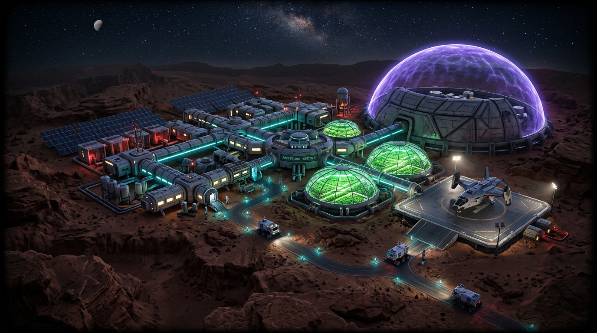
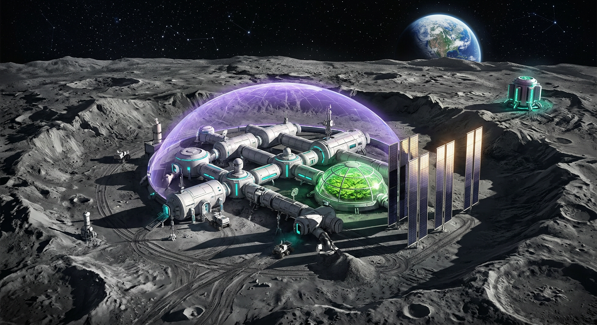

# 🚀 Ares Mission Control // Junior Astronaut Mission Trainer

<div align="center">

[](https://www.spaceappschallenge.org/)
[](https://nextjs.org/)
[](https://www.typescriptlang.org/)
[](https://tailwindcss.com/)

**Command your own planetary outpost on Mars or the Moon, manage life support and power grids, survive solar storms, and learn real NASA science!**

</div>

---

## 🌌 Mission Overview

**Ares Mission Control** is an immersive mission strategy and simulation game built for the **NASA Space Apps Challenge**. Players step into the shoes of a mission commander overseeing a human outpost on either the **Red Planet (Mars)** or the **Lunar South Pole (Moon)**. 

Your objective: Balance power generation, life support (Oxygen & Water), food production, and radiation shielding across multiple sols (days) while surviving unpredictable cosmic hazards like solar flares and planet-wide dust storms.

---

## 🪐 Outpost Environments

<table align="center">
  <tr>
    <td align="center"><b>Outpost Ares (Mars)</b></td>
    <td align="center"><b>Artemis Base Shackleton (Moon)</b></td>
  </tr>
  <tr>
    <td align="center"></td>
    <td align="center"></td>
  </tr>
  <tr>
    <td><i>Thin atmosphere, dust storms, 24-min communication delay, and 43% Earth sunlight.</i></td>
    <td><i>Zero atmosphere, extreme radiation, 14-day lunar nights, and solar power blackouts.</i></td>
  </tr>
</table>

---

## ⚡ Core Features

- **🎮 Strategic Resource Management:** Allocate power between Life Support, Greenhouse, Radiation Shielding, and Scientific Research.
- **📡 Real NASA API Integration:** Connects live to the **NASA DONKI** (Space Weather Database) for real solar flare telemetry and **NASA InSight** historical Mars weather data.
- **🌪️ Dynamic Hazards:** Survive solar flares, micrometeorites, equipment failures, and prolonged lunar nights.
- **🌐 Bilingual Support:** Fully playable in both **English** and **Bengali (বাংলা)**.
- **📊 Detailed Debriefing & Badges:** Earn achievement badges (Radiation Guardian, Green Thumb, Power Pro, etc.) upon completing your mission.

---

## 🛠️ Tech Stack

- **Framework:** [Next.js 16](https://nextjs.org/) (App Router & React 19)
- **Language:** [TypeScript](https://www.typescriptlang.org/)
- **Styling:** [Tailwind CSS v4](https://tailwindcss.com/) & [Shadcn UI](https://ui.shadcn.com/)
- **Icons:** [Lucide React](https://lucide.dev/)
- **Package Manager:** `npm` / `pnpm`

---

## 🚀 Getting Started Locally

### Prerequisites
Make sure you have [Node.js](https://nodejs.org/) installed on your system.

### Installation

1. **Clone the repository:**
   ```bash
   git clone https://github.com/jihadjp/ares-mission-control.git
   cd ares-mission-control
   ```

2. **Install dependencies:**
   ```bash
   npm install
   # or
   pnpm install
   ```

3. **Configure Environment Variables (Optional for Live NASA Data):**
   Create a `.env.local` file in the root directory:
   ```env
   NEXT_PUBLIC_NASA_API_KEY=DEMO_KEY
   ```
   *(You can get a free personal API key from [api.nasa.gov](https://api.nasa.gov/))*

4. **Run the development server:**
   ```bash
   npm run dev
   # or
   pnpm dev
   ```

5. Open [http://localhost:3000](http://localhost:3000) in your browser to start your mission!

---

## 📜 License

Distributed under the MIT License. See `LICENSE` for more information.

---

<div align="center">
  <p><b>Built with passion for space exploration and science education. 🚀🛰️</b></p>
</div>
